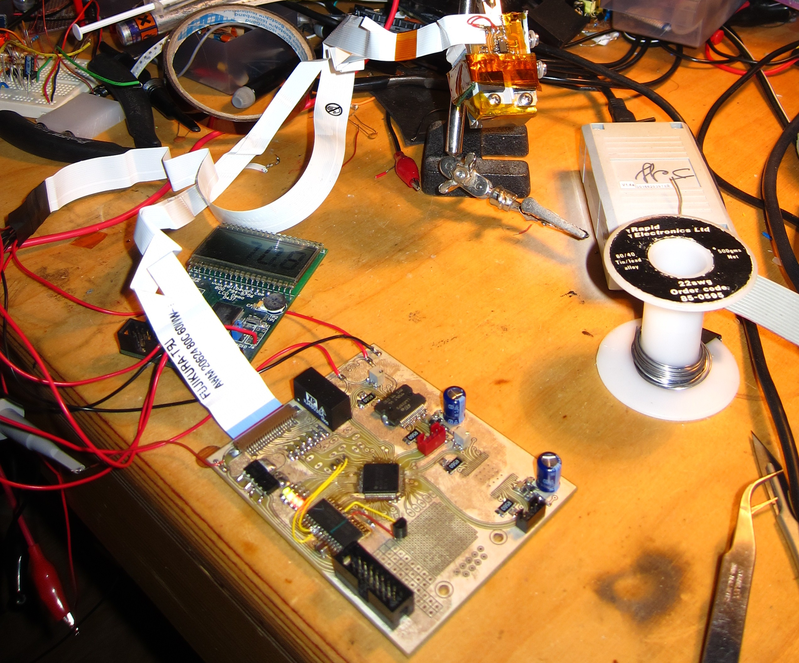

# Crayon
This project explores the possibility of making prototype PCB's by inkjet printing wax as an etch resist.

The whole printer

Results

# System Overview

## Motion Platform

Crayon is built on the chassis of a very old inkjet printer. It's old enough to use stepper motors for both the carriage axis and media feed axis.

## Printhead Assembly

The printhead from an Epson Stylus S21 was chosen for printing the wax. It is mounted to a custom machined heated reservoir block to hold and melt the wax. The original drive electronics from the S21 was reverse engineered, allowing a custom print controller board to be built.

## Heater

A custom heater PCB heats the reservoir block with a power transistor. A MSP430F437 microcontroller development board runs a PID control algorithm to set the temperature, and displays it on an LCD.

## Controller

The heart of the printer is a custom controller PCB that generates the print data and drive waveforms for the printhead, and drives the stepper motors in the motion platform. It is based on an MSP430F2618 microcontroller. The controller is a complete replacement for the one in the Stylus S21 - the printhead interface has been completely reverse engineered, permitting full control of the printing parameters. 

